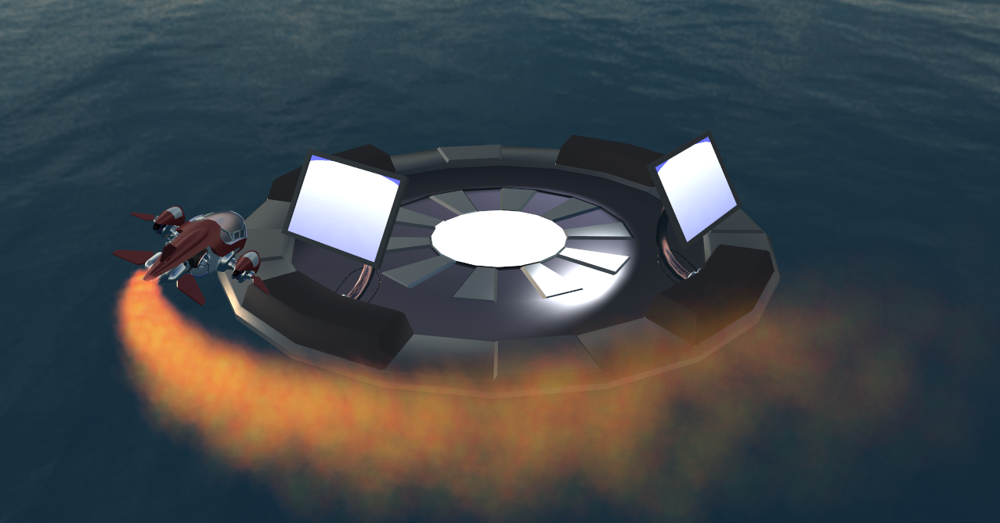

# Description
Graphics programming project (and labs) from the course Computer graphics, held @ Chalmers/GU. Project constitutes implementing a particle system in the form of fire exhaust from a spaceship.

Based on https://gitlab.com/chalmerscg/tda362-labs-2019
